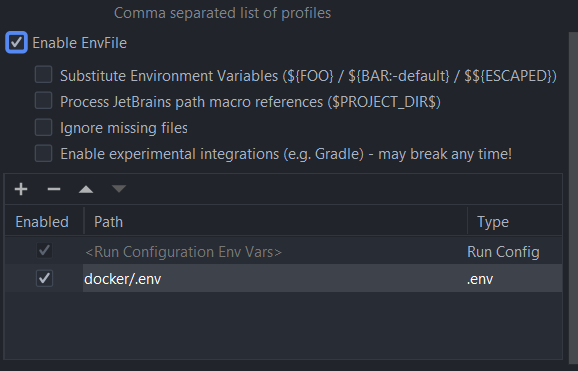

<h2>Used Technologies</h2>
ReactJS, TypeScript, SwaggerUI, Jest, JavaScript, Redux, Sass, EsLint, Lombok, ModelMapper, H2 Database, Material, Java Spring Boot, Postgres, Docker, Kubernetes, Azure, Git
<br>
<h2> Frontend </h2>
# Getting Started with Create React App

This project was bootstrapped with [Create React App](https://github.com/facebook/create-react-app).

##Configuration
###Configure OICD
You can configure your OICD Environment Variables (like Client ID).
Create app-config.js file as specified in example.
For BAG -> see Onboarding Wiki

## Available Scripts

In the project directory, you can run:

### `npm start`

Runs the app in the development mode.\
Open [http://localhost:3000](http://localhost:3000) to view it in the browser.

The page will reload if you make edits.\
You will also see any lint errors in the console.

### `npm test`

Launches the test runner in the interactive watch mode.\
See the section about [running tests](https://facebook.github.io/create-react-app/docs/running-tests) for more information.

### `npm run build`

Builds the app for production to the `build` folder.\
It correctly bundles React in production mode and optimizes the build for the best performance.

The build is minified and the filenames include the hashes.\
Your app is ready to be deployed!

See the section about [deployment](https://facebook.github.io/create-react-app/docs/deployment) for more information.

### `npm run eject`

**Note: this is a one-way operation. Once you `eject`, you can’t go back!**

If you aren’t satisfied with the build tool and configuration choices, you can `eject` at any time. This command will remove the single build dependency from your project.

Instead, it will copy all the configuration files and the transitive dependencies (webpack, Babel, ESLint, etc) right into your project so you have full control over them. All of the commands except `eject` will still work, but they will point to the copied scripts so you can tweak them. At this point you’re on your own.

You don’t have to ever use `eject`. The curated feature set is suitable for small and middle deployments, and you shouldn’t feel obligated to use this feature. However we understand that this tool wouldn’t be useful if you couldn’t customize it when you are ready for it.

## Learn More

You can learn more in the [Create React App documentation](https://facebook.github.io/create-react-app/docs/getting-started).

To learn React, check out the [React documentation](https://reactjs.org/).

<h1>Backend</h1>
# Diversity Lunch Spring Boot Backend

## IntelliJ
### 1. build
Using the Maven tool window or via `./mvnw package` the project can be compiled, tested and packaged.

### 2. resources
Via the Docker Compose file, a database and SMTP server can be started for development.
The command ``docker-compoise up -d db`` can be used for the database
and the command ``docker-compose up -d mailhog`` for the SMTP server.

The application.yml under ``src/main/resources`` must be adapted for local development.
For this the commented out part under ``# Mail Settings Local`` must be inserted and the part under ``# Mail Setting Sendgrid`` must be commented out.
must be commented out.

**!Important!:** For the Dev environment SendGrind must be inserted again.

**Disclaimer:** A local application.yml still needs to be introduced.

### 3. run / debug
A new Spring Boot Config must be created, which points to the class `en.brockhausag.diversitylunchspringboot.DiversityLunchSpringBootApplication`.
To start, the database must be running (can be started via Docker Compose).
In order for the backend to connect to the DB, the environment variables must be set in IntelliJ Config as they are entered in the file ``docker/.env``.
Additionally the environment variable DB_HOST=localhost must be set.<br>
### 4. Testing
#### Unit und Integration Tests
The tests are found under ''src/test/''. <br>
For coverage, the coverage runner in IntelliJ should be converted to JaCoCo.

------------------------

## Docker
### 1. Dockerfile
### 2. Docker Compose
The Docker compose 'docker/docker-compose.yaml' can be used to start the database and backend locally.
In order for the containers to be configured correctly, there must be a file with environment variables under the path
'docker/.env', in which the variables 'POSTGRES_USER', 'POSTGRES_PASSWORD' and 'POSTGRES_DB' are set.


## Kubernetes

We recommend a Kubernetes cluster to deploy.

More information for BAG employees: https://dev.azure.com/brockhaus-ag/Diversity-Lunch/_wiki/wikis/Diversity-Lunch.wiki/2857/Kubernetes

-------------------------

## Adding Customers to Project

To add a list of customers to Diversity Lunch, you have to edit the file `customers.txt` located
in `Diversity-Lunch-App`. Take your list and paste it into the file, **with one customer a line**.

Afterwards start `AddCustomersToProject.js`. This file takes care of adding the customers to all necessary files.

You can start the script with the console by typing `node AddCustomersToProject.js`. Assure that you are
located in `Diversity-Lunch-App` where `diversity-lunch-be` and `diversity-lunch-fe` are located.

**Be aware to leave an entry `Sonstiges` in `customers.txt`. The reason for this is that the tests
need this entry to work properly.**

If you dont want to have an entry like this you have to edit the tests
in `diversity-lunch-fe` in `ProfileOverview.test.tsx`. Under `projects:'Sonstiges'` you have to replace `Sonstiges`
with one customer/ project thats inside `customers.txt`.

-------------------------

## CI / CD
The CI pipeline runs automatically when pushed to ``dev`` and builds a Docker image which is loaded into our registry.
The CD pipeline runs automatically after the CI pipeline runs and deploys our Kubernetes configs to our cluster.

-------------------------
<h1>Deployment</h1>
<h2>Azure Active Directory</h2>

###Backend Configuration
A `.env` file is required for the local installation of the backend. A sample file is located in the subfolder  `docker`. Creates the `.env` file in the same place and populate it with the following content:

```
POSTGRES_USER=exampleUser
POSTGRES_PASSWORD=examplePassword
POSTGRES_DB=exampleDBName
DB_HOST=IP-Address of DBHost eg. localhost
MAIL_HOST=IP-Address of MailHost
MAIL_PORT=1025
MAIL_USERNAME=exampleUser
MAIL_PASSWORD=examplePassword
MAIL_ADDRESS=exampleMail
ISSUER_URI=https://sts.windows.net/TENANT_ID/`
TENANT_ID=your Tenant ID
CLIENT_ID=your Client ID
CLIENT_SECRET=your Client Secret
DIVERSITY_LUNCH_USER_ID=your Diversity Lunch User ID
```

###How to set the Ids?

To get the required ids you have to go into your azure account to your application. 
You have to copy and paste the **application-id** to `CLIENT_ID`, **directory-id** to `TENANT_ID`,
and your **private key** to `CLIENT_SECRET`. To get the `ISSUER_URI` you have to concatenate
the `TENANT_ID` to `https://sts.windows.net/`.
<br/>
<br/>
Example:
`ISSUER_URI=https://sts.windows.net/TENANT_ID/`

The `DIVERSITY_LUNCH_USER_ID` is required to send emails to users after a match.
You have to create a technical user in your azure app. The technical users task is to
send notification-mails to each user of a match.<br/>
To get the `DIVERSITY_LUNCH_USER_ID` just copy the **Object-Id** from your technical user and 
paste it to `DIVERSITY_LUNCH_USER_ID`.


With the plugin [EnvFile](https://plugins.jetbrains.com/plugin/7861-envfile) IntelliJ can set the file as an environment for the run time configuration:

### Deployment


###Frontend Configuration
To configure this, the file 'app-config.js' must be created in the folder 'Public/config' and the following content must be added:
```javascript
    window.appConfig = {
       REACT_APP_OIDC_CLIENT_ID: 'your Client ID',
       REACT_APP_OIDC_SCOPE: 'your Client ID/.default openid profile email',
       REACT_APP_OIDC_CONFIG_ENDPOINT: 'Microsoft Endpoint Configuration',
       REACT_APP_OIDC_REDIRECT_URI: 'https://DomainOfYourSite.com/',
       REACT_APP_OIDC_AUTHORIZATION_ENDPOINT: 'Microsoft Endpoint Authorization',
    };
```

The client-Id ist the id from your App that you already used for the backend. <br/><br/>
`REACT_APP_OIDC_CLIENT_ID`: Your Client-Id.<br/><br/>
`REACT_APP_OIDC_SCOPE`: `REACT_APP_OIDC_CLIENT_ID/.default openid profile email`<br/><br/>
`REACT_APP_OIDC_CONFIG_ENDPOINT`: `https://login.microsoftonline.com/TENANT_ID/.well-known/openid-configuration` <br/><br/>
`REACT_APP_OIDC_REDIRECT_URI`: URL to your Diversity-Lunch-App<br/><br/>
`REACT_APP_OIDC_AUTHORIZATION_ENDPOINT`: `'https://login.microsoftonline.com/TENANT_ID/oauth2/v2.0/authorize` <br/><br/>


###Liquibase
More information at: https://www.liquibase.org/
Initial setting of Liquibase:
For local tests/execution (BAGler) create the liquibase.poproperties file as specified in the sample:
``` 
url=jdbc:postgresql://localhost:5432/diversity-lunch
username=spring-backend
password=SomeRandomPassword
driver=org.postgresql.Driver
outputChangeLogFile=src/main/resources/db/changelog/migrations/init_db_migration.sql
changeLogFile=src/main/resources/db/changelog/db.changelog-master.yaml
```

For existing databases:<br>
`liquibase changelog-sync`<br>
More helpers to use Liquibase at<br>
`liquibase --help`<br>
Rough overview:<br>
`liquibase validate` validate<br>
`liquibase XXXX-sql` Test variant of the command. Always recommended to run beforehand:<br>
i.e.<br>
`liquibase update-sql` -> `liquibase update`<br>
`liquibase status` returns the status<br>
`liquibase rollback` rollback of changesets.<br>

Liquibase should be used as in Example Migration file.
1. One change per changeset.
2. Changesets as commented in example
3. Added rollback plan
4. Always write new migration files even if something is deleted from the db. -> Update, Age, Insert etc.
